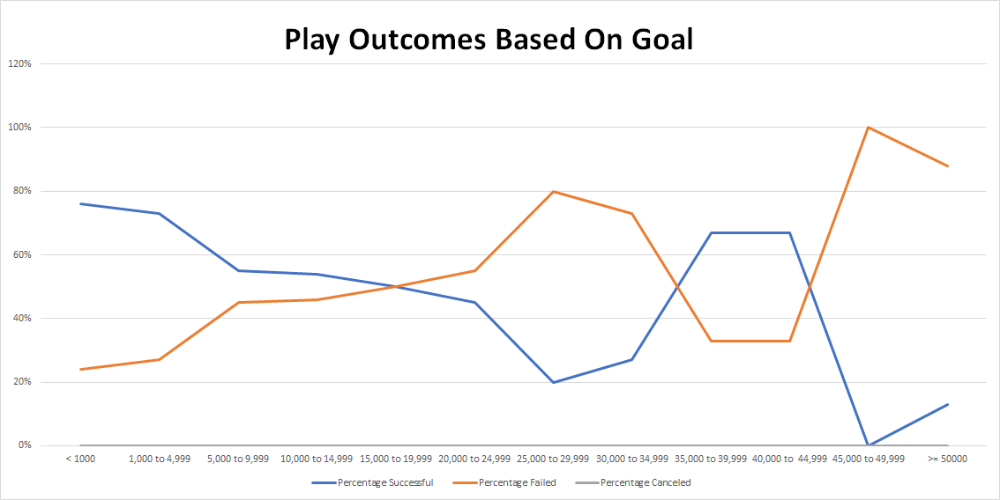

# Kickstarting with Excel

## I. Overview of Project

### Background
Louise had a successful kickstarter campaign with her play "Fever". Now, she wants to know how different campaigns fared in comparison to her project. 

### Objective
In order for Louise to replicate or even do better in future projects, we will use data analysis and visualization to show Louise the outcomes of other campaigns based on their launch dates and funding goals to use in her comparison. 

## II. [Analysis and Results](Kickstarter_Challenge.xlsx)

### A. Outcomes Based on Launch Date

The figure above shows the outcomes of kickstarter campaigns in the Theater category versus the month of their launch date. First, we can see that the low number of canceled campaigns prevents us from seeing a significant trend in that category. The highest spikes for both the successful and failed campaigns are both in May which means this month is the busiest with the most campaigns launched. This is also with good reason, as May is also the month where the blue line is farthest away from the red line, meaning this month has the **highest sucess rate. Future campaigns should target possibly launching on May**. On the other end, December is the month where the blue line is closest to the red line, they are virtually equal. **Launching a campaign in December has the lowest rate of success and should be avoided in the future projects**.

### B. Outcomes Based on Goals

The figure above shows the outcomes of kickstarter campaigns in the Plays subcategory versus their target goals. This subcategory has no canceled campaigns and will not show up in the graph. As expected, the lowest target value (<1000) has the highest success rate. The high success rate is only maintained until (1,000 to 4,999) as you get around 50% chances for success afterwards, which is not ideal. Unexpectedly, the trend for having low success rate as the goal goes higher is broken at targets (35,000 to 39,999) and (40,000 to 44,999). Even though it shows good success values, the low number of data points (<1% of total plays) on these 2 goal targets makes it inconclusive to label as a good goal to set if you want to target a large amount. This is one of the limitations of using percentage in the visualization. **Therefore, with the best value to success rate balance, the sweet spot for a goal is in the (1,000 to 4,999) value.**

### C. Additional Analysis
In addition to launch dates and target goals, determining how long the campaign should be can help the success of the project.

Contrary to the expected, having a longer campaign does not guarantee success. The most common and also most successful deadlines are set at 5th week after launching.

### D. Challenges
The tasks were simple and straightforward, but possible challenges can be encountered in making the table for "Play Outcomes based on Goal". The COUNTIFS formulas you had to type were long and and it was easy to make a typo on the 5-digit numbers. This can be overcome by going slowly but surely on typing the numbers, and typing it the least number of times possible by using the drag and formula autofill function strategically.

## III. Limitations of the Data
- **The number of data points are not enough.** Segmenting the data of a subcategory will sometimes just give you 1 or 2 data points in 1 segment (e.g. Play Outcomes based on Goal)
- **The data is outdated.** If Louise will use our analyses for future projects, something more recent than the (2009 to 2017) figures will be necessary
- **About 75% of the data comes from the USA.** Plays or musicals, especially those that need kickstarters are a very local event. Louise wants to someday start a campaign for a Great Britain event and analyses made should be more focused on local data.
- **Only for kickstarter.** The title is a dead give-away but it should still be said that this study is limited to Kickstarter and does not include all other crowdfunding apps.
